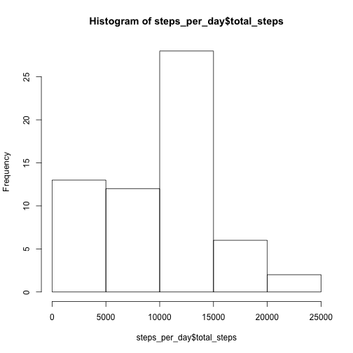
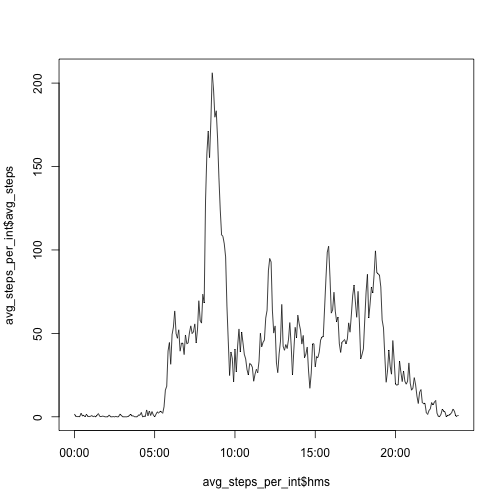
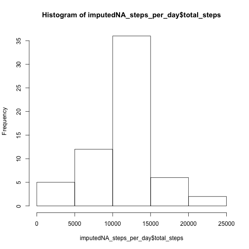
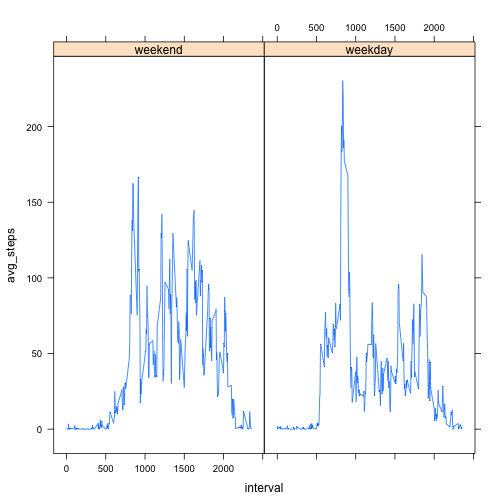

## Loading and preprocessing the data
One of the principles of reproducable research is start processing your data from its raw form.  So I start here by unzipping the original data archive.  I avoid this step if it has already been done.

### Loading

```r
if(!file.exists("activity.csv"))
{
    unzip("activity.zip")
}

steps <- read.csv("activity.csv")
str(steps)
```

```
## 'data.frame':	17568 obs. of  3 variables:
##  $ steps   : int  NA NA NA NA NA NA NA NA NA NA ...
##  $ date    : Factor w/ 61 levels "2012-10-01","2012-10-02",..: 1 1 1 1 1 1 1 1 1 1 ...
##  $ interval: int  0 5 10 15 20 25 30 35 40 45 ...
```

### Preprocessing
I'll need to summarize this data by date and figure out what days are weekends and weekdays to answer the questions below.  So I'm going to convert the dates from strings to date class objects.  We also need to convert the interval identifiers to minutes.  I'll attach these to the date to make it easier to plot time series data later.

```r
library(lubridate)
steps$date <- ymd(steps$date)
str(steps)
```

```
## 'data.frame':	17568 obs. of  3 variables:
##  $ steps   : int  NA NA NA NA NA NA NA NA NA NA ...
##  $ date    : POSIXct, format: "2012-10-01" "2012-10-01" ...
##  $ interval: int  0 5 10 15 20 25 30 35 40 45 ...
```

## What is mean total number of steps taken per day?
We'll need to summarize the number of steps by day here.  Dplyr has a handy function for this:

```r
library(dplyr)
```

```
## 
## Attaching package: 'dplyr'
## 
## The following objects are masked from 'package:lubridate':
## 
##     intersect, setdiff, union
## 
## The following object is masked from 'package:stats':
## 
##     filter
## 
## The following objects are masked from 'package:base':
## 
##     intersect, setdiff, setequal, union
```

```r
steps_per_day <- steps %>% group_by(date) %>% summarize(total_steps = sum(steps,na.rm=TRUE))
hist(steps_per_day$total_steps)
```

 

```r
mean_steps_per_day <- round(steps_per_day %>% summarize(mean(total_steps)))
median_steps_per_day <- steps_per_day %>% summarize(median(total_steps))
```
So the mean total number of steps taken per day is: 9354  
The median total number of steps taken per day is: 10395


## What is the average daily activity pattern?
Here we will average the number of steps across the days during each 5 minute activity period.

```r
avg_steps_per_int <- steps %>% group_by(interval) %>% summarize(avg_steps = mean(steps,na.rm=TRUE))

library(stringr)
avg_steps_per_int$interval <- str_pad(avg_steps_per_int$interval,4,pad="0") # pad the hours and min for the time interval so that they are consistent
avg_steps_per_int$hour <- substr(avg_steps_per_int$interval,1,2)
avg_steps_per_int$min <- substr(avg_steps_per_int$interval,3,4)
avg_steps_per_int$hms <- ymd_hms(paste("681122",avg_steps_per_int$hour,avg_steps_per_int$min,"00")) # just picking a random date here to make the plot look nice
 plot(avg_steps_per_int$hms, avg_steps_per_int$avg_steps,type="l")
```

 

```r
sorted_by_avg_steps <- avg_steps_per_int %>% arrange(desc(avg_steps))
max_avg_step <- sorted_by_avg_steps[1,2]
hour <- sorted_by_avg_steps[1,3]
min <- sorted_by_avg_steps[1,4]
```

So the maximum number of average steps taken is: 206.1698113 at 08:35

## Imputing missing values
### Amount of population with missing values
Let's get a sense of how complete our data is by figuring out how many missing values we have:

```r
nas <- table(is.na(steps$steps))
missing <- nas[2]
percent_missing <- round(nas[2] / (nas[1]+nas[2]) * 100)
```
So we have 2304 missing values which is 13% of the total population.

### Strategy for imputing missing values
Our strategy for imputing missing values will be to use the average number of steps taken for the interval in question to impute any given missing interval step data.  We'll do this by creating a new table that links our step data to the table we made above to get the average number of steps per interval across all the days:

```r
avg_steps_per_int$interval <- as.integer(avg_steps_per_int$interval)
imputed_na_steps <- steps %>% left_join(avg_steps_per_int)
```

```
## Joining by: "interval"
```

```r
# replace the NAs with the average for the interval
isNA <- is.na(imputed_na_steps$steps)
imputed_na_steps[isNA,]$steps <- as.integer(round(imputed_na_steps[isNA,]$avg_steps))

# get rid of extraneous columns so that our new data set is equal to the first but with NAs filled in
imputed_na_steps <- imputed_na_steps[1:3]

# Here is the first steps dataset and the imputed NA dataset.  Notices that the first has NAs in the interval while the second has the NAs replaced with the interval average
str(steps)
```

```
## 'data.frame':	17568 obs. of  3 variables:
##  $ steps   : int  NA NA NA NA NA NA NA NA NA NA ...
##  $ date    : POSIXct, format: "2012-10-01" "2012-10-01" ...
##  $ interval: int  0 5 10 15 20 25 30 35 40 45 ...
```

```r
str(imputed_na_steps)
```

```
## 'data.frame':	17568 obs. of  3 variables:
##  $ steps   : int  2 0 0 0 0 2 1 1 0 1 ...
##  $ date    : POSIXct, format: "2012-10-01" "2012-10-01" ...
##  $ interval: int  0 5 10 15 20 25 30 35 40 45 ...
```

```r
imputedNA_steps_per_day <- imputed_na_steps %>% group_by(date) %>% summarize(total_steps = sum(steps))
hist(imputedNA_steps_per_day$total_steps)
```

 

```r
imputedNA_mean_steps_per_day <- round(imputedNA_steps_per_day %>% summarize(mean(total_steps)))
imputedNA_median_steps_per_day <- round(imputedNA_steps_per_day %>% summarize(median(total_steps)))
```
So now that we have imputed values for NA we can make the following comparison to get a sense of how imputing the missing values affects our anaysis:  
imputed NAs mean: 1.0766 &times; 10<sup>4</sup>  
imputed NAs median: 1.0762 &times; 10<sup>4</sup>  

ignoring NAs mean: 9354  
ignoring NAs median: 10395

The two strategies of ignoring NA values versus imputing them does have an affect on our analysis.  When we impute the values the mean and the median shift to larger values.  Looking at the two histograms of the total steps we can see that ignoring the NAs has the effect of showing an increased number of days with 0 - 5000 steps.  Imputing the NAs creates a *normal* distribution.


## Are there differences in activity patterns between weekdays and weekends?

```r
# add a factor variable with the weekend or weekday
imputed_na_steps$type <- factor((weekdays(imputed_na_steps$date) %in% c("Saturday","Sunday"))+1L,levels=1:2,labels=c('weekday','weekend'))

# get the average steps on weekends
avg_steps_per_int_we <- imputed_na_steps %>% filter(type=="weekend") %>% group_by(interval) %>% summarize(avg_steps = mean(steps,na.rm=TRUE))
avg_steps_per_int_we$type <- factor("weekend")

# get the average steps for the intervals on weekdays
avg_steps_per_int_wd <- imputed_na_steps %>% filter(type=="weekday") %>% group_by(interval) %>% summarize(avg_steps = mean(steps,na.rm=TRUE))
avg_steps_per_int_wd$type <- factor("weekday")

# join the avg_step tables
wsteps <- merge(avg_steps_per_int_we,avg_steps_per_int_wd, all=TRUE)

library(lattice)
xyplot(avg_steps ~ interval | type, data=wsteps, type="l")
```

 

So we can see from the plot that the subject walks further on morning weekdays.
